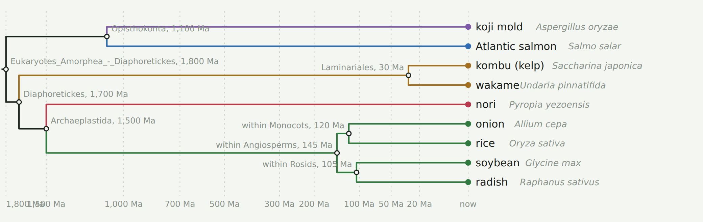
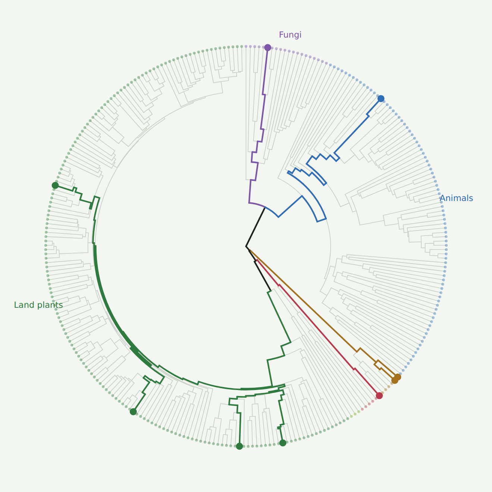

# Phyloplate

**How much of the tree of life is on your plate?**

Phyloplate scores a meal by the phylogenetic diversity of the organisms in it. You paste a recipe or name a dish; the app maps each ingredient to the species it came from, prunes a dated tree of edible eukaryotes down to those species, and adds up the branch lengths. The result is Faith's phylogenetic diversity (PD) in millions of years of evolution, reported alongside plain species richness, a coverage percentage, and a drawing of the meal's tree.

A cheeseburger with fries is about 3.7 billion years of branch length. A Japanese set meal with kombu, nori, and miso is about 7.7. A pinch of nori adds more than the entire spice rack, because red algae split from land plants about 1.4 billion years ago and thyme split from oregano about 12 million years ago.



## The idea

Dietary species richness (the number of species eaten) has been proposed as a measure of food biodiversity and shown to track nutrient adequacy (Lachat et al. 2018, *PNAS*). Phyloplate is the phylogenetic version of that count, in the same way that Faith's PD (1992) was the phylogenetic version of species richness in conservation biology. Whether PD on a plate predicts anything nutritionally is an open question; the point here is that it is computable, visual, and fun, and that it makes deep time tangible. Two meals with the same number of species can differ tenfold in PD, and the difference is always the same story: seaweed, mushrooms, and the odd invertebrate.

Prokaryotes are excluded on purpose (they are on everything). Amounts are ignored in the current version; an abundance-weighted score (Chao, Chiu & Jost's phylogenetic Hill numbers) is the planned next step.

## What is in this repository

| Path | What it is |
|---|---|
| `data/edible_eukaryotes.txt` | The curated list of eukaryotes people eat: 3,279 species with common names and families, grouped by clade. **This is the primary data product.** Edit this file; the CSV is generated from it. |
| `data/edible_eukaryotes_candidates.csv` | The same list as a CSV (species, common name, genus, family, clade, group). |
| `curation/curation.py` | Synonym map for names as TimeTree and other sources return them; the table of hand-placed families (anchor groups and stem ages); higher-clade node names; tree version and changelog. |
| `curation/anchor_review.csv` | One row per hand-placed family with the basis for the placement, a confidence rating, and blank columns for expert review. |
| `scripts/assemble_tree.py` | Takes any dated Newick plus the species list and produces the app's tree: matches species, applies synonyms, gap-fills missing species next to congeners, at family nodes, or by anchor, names internal nodes, and writes a report. Pure Python, no dependencies. |
| `scripts/bake.py` | Builds the single-file app from a tree and the HTML template. |
| `scripts/make_placeholder_tree.py` | Generates the original 289-taxon placeholder tree, from hand-set node ages (kept for the record). |
| `app/template.html` | The app: ingredient parsing, PD and richness, meal phylogram, radial coverage view, meal log, custom-tree loader. |
| `app/phyloplate_demo.html` | A working demo built on the open tree. Live at https://mjhickerson.github.io/phyloplate/app/phyloplate_demo.html |
| `tree/` | The open tree (`food_tree.newick`, `taxa.csv`), its version stamp, provenance, seam report and assembly report. |
| `scripts/graft_tree.py`, `scripts/backbone.py` | The graft step: stitches pruned published chronograms onto the cited backbone. Source trees are not included (large; all are public downloads listed in `backbone.py`). |



## About the tree and its ages

**The demo in this repository runs on the open tree, version `open-0.11`**: all 3,279 listed species, assembled entirely from published, redistributable chronograms grafted onto a backbone of deep-node ages, plus a class- and order-level skeleton for the groups that have no species-level open chronogram. Sources:

| Source | What it dates | Species placed |
|---|---|---|
| Strassert et al. 2021, *Nat Commun* | deep eukaryote nodes (root 2,132 Ma) | backbone |
| Irisarri et al. 2017, *Nat Ecol Evol* | jawed-vertebrate nodes | backbone |
| Smith & Brown 2018, *Am J Bot* (ALLMB) | seed plants | 1,796 |
| Nitta et al. 2022, *Front Plant Sci* (FTOL) | ferns | 10 |
| Rabosky et al. 2018, *Nature* (Fish Tree of Life) | ray-finned fishes | 533 |
| Upham et al. 2019, *PLoS Biol* (MamPhy) | mammals | 127 |
| Jetz et al. 2012, *Nature* (birdtree.org subset) | birds | 70 |
| Stein et al. 2018, *Nat Ecol Evol* (VertLife subset) | sharks, rays, chimaeras | 14 |
| Jetz & Pyron 2018, *Nat Ecol Evol* (VertLife subset) | amphibians | 8 |
| Tonini et al. 2016, *Biol Conserv* (VertLife subset) | squamates | 12 |
| Varga et al. 2019, *Nat Ecol Evol* | mushrooms (Agaricomycotina) | 75 |
| Shen et al. 2020, *Sci Adv* | ascomycete fungi (yeasts, moulds, truffles, morels) | 20 |

Each source keeps its own internal ages and hangs from the backbone at its crown. When a source is pruned to our species, one non-food relative per needed genus is kept so that a species the source lacks can be hung beside a real congener. Molluscs, crustaceans, insects, seaweeds, turtles, crocodilians and the small phyla (about 310 species) have no species-level open chronogram; their families sit on a skeleton of class- and order-level nodes in `scripts/backbone.py`, mapped in `PLACEMENTS_OPEN` in `curation/curation.py`. Most skeleton ages are approximate and listed for review in `curation/node_review_open.csv`, with the number of species each node carries. Families on the skeleton join at their node's crown, which slightly overstates PD for those groups. The seam report (`tree/seam_report.txt`) lists every graft, and `tree/assembly_report.txt` every placement.

The working prototype used during development ran on a tree with divergence times from TimeTree 5 (Kumar et al. 2022). TimeTree's terms of use restrict redistribution of its data and transformations of it, so that tree is **not** included here, and no file derived from it will be committed.

Corrections from specialists are welcome as pull requests to `curation/curation.py` or `scripts/backbone.py`, or as filled-in rows of `curation/anchor_review.csv`. Every change to the tree bumps its version and gets a changelog line.

## Running the pipeline

```
# regenerate the CSV from the text list
python3 scripts/build_candidates.py data/edible_eukaryotes.txt data/edible_eukaryotes_candidates.csv

# assemble an app tree from any dated Newick (tips = species names)
python3 scripts/assemble_tree.py dated.nwk data/edible_eukaryotes_candidates.csv out/

# build the app
python3 scripts/bake.py out/food_tree.newick out/taxa.csv app/template.html phyloplate.html
```

`assemble_tree.py` imports `curation.py` from the working directory if present. The report it writes (`assembly_report.txt`) lists every species that was matched, renamed, gap-filled, or left out.

Ingredient parsing in the app uses a language model to turn recipe text into Latin binomials, which the page then resolves against its own taxon table; nothing outside the table can be scored. In the demo build the model call is unavailable, and the app falls back to keyword matching against the table's alias column.

## Status and roadmap

- [x] Working prototype: parsing, PD, richness, coverage, meal phylogram, radial coverage, meal log
- [x] Species list (3,279) and placement tables
- [x] Assembly pipeline with synonyms, gap-filling, node naming, versioning
- [x] Open, redistributable dated tree (v0.4: every listed species placed; nine species-level sources; decapod, bivalve and insect-order and brown-algal skeletons dated from Wolfe et al. 2019, Li et al. 2025, Misof et al. 2014, Peters et al. 2017, Kawahara et al. 2019 and Choi et al. 2024, Tanner et al. 2017; other invertebrate, algal and ascomycete skeleton ages under review)
- [ ] Standalone hosting with the tree server-side
- [ ] Abundance-weighted PD (phylogenetic Hill numbers)
- [ ] Per-week aggregation and a richness-controlled coverage score

## Citing

Hickerson, M.J. (2026). Phyloplate: phylogenetic diversity of what you eat. Software and data, version 0.1.0. https://github.com/<user>/phyloplate

Code is MIT-licensed; the species list and curation tables are CC BY 4.0 (see `data/LICENSE`).

## Acknowledgements

Faith (1992) for PD; Lachat et al. (2018) for dietary species richness; TimeTree (Kumar et al. 2022) for the divergence times in the working build. The idea dates from about 2015, when a grad student sensibly declined to build it.
